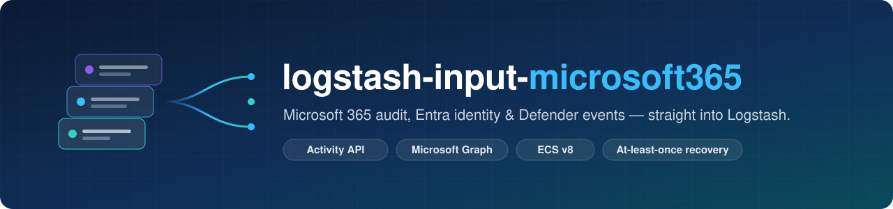
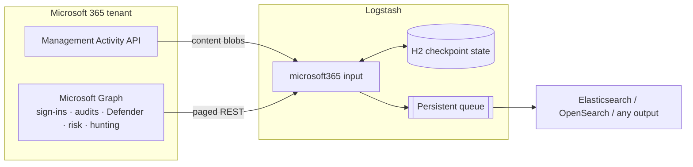

<div align="center">



<br>

**Microsoft 365 audit, Entra ID, Defender, and Identity Protection events, streamed into Logstash through official REST APIs.**

[](https://github.com/basht0p/M365-Logstash-Input-Plugin/actions/workflows/ci.yml)
[](LICENSE)
[](logstash-input-microsoft365.gemspec)
[](docs/validation-status.md)

[](https://www.elastic.co/logstash)
[](https://www.elastic.co/logstash)
[](https://www.jruby.org)
[](https://adoptium.net)
[](https://www.elastic.co/guide/en/ecs/current/index.html)
[](scripts/Initialize-M365LogstashTenant.ps1)

[**Get started**](docs/get-started.md) ·
[**Collectors**](docs/collectors-and-permissions.md) ·
[**Operations**](docs/operations.md) ·
[**Architecture**](docs/architecture.md) ·
[**Examples**](examples/)

</div>

---

## Why this plugin?

Getting Microsoft 365 telemetry into a SIEM usually means stitching together scripts, cron jobs, and a separate checkpoint file for each API. `logstash-input-microsoft365` does all of that inside one Logstash input:

- 🔌 **One input per tenant.** Each input has its own credentials, cloud profile, and durable checkpoint store.
- 🛡️ **Nine collectors.** Unified audit log, sign-ins, directory audits, Defender alerts and incidents, risk detections, risky users, and Advanced Hunting.
- 🔁 **Built for recovery.** H2-backed checkpoints, overlap sweeps for late records, scheduled reconciliation, one-shot replay, and dedupe that holds past 100k identities.
- 🧭 **ECS v8 out of the box.** Common fields are mapped for you, the full vendor payload stays under `microsoft.raw`, and deterministic `document_id` and `entity_id` values support idempotent writes.
- 🏛️ **Four cloud profiles.** Commercial, GCC, GCC High, and DoD, each with the correct authority, Graph, and Activity API endpoints.
- 🔐 **Least-privilege provisioning.** A PowerShell helper creates the Entra app and requests only the permissions your chosen collectors need.
- 📦 **Air-gap friendly.** The gem vendors pinned Java dependencies, and CI builds offline install packs and tests them in containers with networking disabled.

> [!IMPORTANT]
> **Pre-release.** Automated tests, packaging, and runtime checks pass on Logstash 8.19.22 and 9.5.4, but no live-tenant smoke tests have been reported yet. Read the [validation status](docs/validation-status.md) before deploying to production.

## How it works



The input authenticates with MSAL (certificate or client secret), schedules each enabled collector, and walks bounded time windows. A window that exceeds its page budget is split automatically. Progress and delivered record identities are stored in a per-tenant H2 database, so restarts resume where collection stopped. See [architecture](docs/architecture.md) for details.

## Quick start

### 1. Provision the tenant app

```powershell
./scripts/Initialize-M365LogstashTenant.ps1 `
  -TenantId "00000000-0000-0000-0000-000000000000" `
  -Cloud commercial `
  -Collectors activity,signin,directory_audit `
  -Phase Plan -WhatIf
```

Run with `-WhatIf` first to preview, then run the `Provision` and consent phases. The full walkthrough is in [provisioning](docs/provisioning.md).

### 2. Build and install

```sh
mvn -B dependency:copy-dependencies
gem build logstash-input-microsoft365.gemspec
bin/logstash-plugin install --no-verify logstash-input-microsoft365-0.1.0.gem
```

### 3. Configure a pipeline

```ruby
input {
  microsoft365 {
    tenant_id            => "00000000-0000-0000-0000-000000000000"
    client_id            => "11111111-1111-1111-1111-111111111111"
    cloud                => "commercial"

    certificate_path     => "/etc/logstash/secrets/m365-client.pfx"
    certificate_password => "${M365_CERTIFICATE_PASSWORD}"
    state_path           => "/var/lib/logstash/m365/example-org"

    collectors => ["activity", "signin", "directory_audit", "defender_alert", "defender_incident"]
  }
}

output {
  stdout { codec => rubydebug { metadata => true } }
}
```

> [!TIP]
> For at-least-once crash recovery, enable a persistent queue with `queue.checkpoint.writes: 1` and keep `state_path` on durable storage. [Operations](docs/operations.md) explains why both are required.

## Collectors

| Collector | Source | Permission |
|---|---|---|
| `activity` | Office 365 Management Activity API | `ActivityFeed.Read` |
| `signin` | Graph sign-in logs (v1.0) | `AuditLog.Read.All` |
| `signin_beta` | Graph sign-in logs (beta, experimental) | `AuditLog.Read.All` |
| `directory_audit` | Graph directory audit logs | `AuditLog.Read.All` |
| `defender_alert` | Defender alerts v2 | `SecurityAlert.Read.All` |
| `defender_incident` | Defender incidents | `SecurityIncident.Read.All` |
| `risk_detection` | Identity Protection risk detections | `IdentityRiskEvent.Read.All` |
| `risky_user` | Identity Protection risky users | `IdentityRiskyUser.Read.All` |
| `hunting` | Defender Advanced Hunting (KQL jobs) | `ThreatHunting.Read.All` |

The defaults are `activity`, `signin`, and `directory_audit`. Optional DLP and Conditional Access enrichment, plus licensing notes, are covered in [collectors and permissions](docs/collectors-and-permissions.md). Scheduled KQL is covered in [Advanced Hunting jobs](docs/hunting.md).

## Cloud profiles

| `cloud` | Authority | Graph | Activity API |
|---|---|---|---|
| `commercial` | `login.microsoftonline.com` | `graph.microsoft.com` | `manage.office.com` |
| `gcc` | `login.microsoftonline.com` | `graph.microsoft.com` | `manage-gcc.office.com` |
| `gcc_high` | `login.microsoftonline.us` | `graph.microsoft.us` | `manage.office365.us` |
| `dod` | `login.microsoftonline.us` | `dod-graph.microsoft.us` | `manage.protection.apps.mil` |

Government clouds have not been verified against live tenants yet. See [cloud profiles](docs/clouds.md).

## Configuration reference

<details>
<summary><b>All input options</b></summary>

<br>

| Option | Type | Default | Notes |
|---|---|---|---|
| `tenant_id` | string | *required* | Entra tenant ID |
| `client_id` | string | *required* | App (client) ID |
| `state_path` | string | *required* | Durable directory for this tenant's H2 checkpoints |
| `cloud` | `commercial` \| `gcc` \| `gcc_high` \| `dod` | `commercial` | Endpoint profile |
| `certificate_path` | path | | PFX used for certificate auth (recommended) |
| `certificate_password` | password | | PFX password |
| `client_secret` | password | | Alternative to certificate auth |
| `organization_id` | string | | Populates `organization.id` |
| `organization_name` | string | | Populates `organization.name` |
| `collectors` | array | `["activity","signin","directory_audit"]` | See [Collectors](#collectors) |
| `activity_content_types` | array | `["Audit.Exchange","Audit.SharePoint","Audit.General"]` | Activity API content types |
| `publisher_identifier` | string | | Activity API publisher ID |
| `include_dlp` | boolean | `false` | Adds `DLP.All` |
| `include_sensitive_dlp` | boolean | `false` | Requires `include_dlp`; adds `ActivityFeed.ReadDlp` |
| `include_conditional_access` | boolean | `false` | Adds CA policy details to sign-ins |
| `allow_beta` | boolean | `false` | Required for `signin_beta` |
| `signin_types` | array | all four types | `interactiveUser`, `nonInteractiveUser`, `servicePrincipal`, `managedIdentity` |
| `hunting_queries_path` | path | | JSON job file for `hunting` |
| `poll_interval` | seconds | `60` | Main polling cadence |
| `hunting_interval` | seconds | `300` | Default hunting job interval |
| `risk_interval` | seconds | `900` | Risk collectors cadence |
| `initial_lookback` | seconds | `86400` | First-run lookback |
| `overlap` | seconds | `900` | Late-arrival sweep window |
| `reconciliation_interval` | seconds | `86400` | How often to re-read `replay_horizon` |
| `replay_horizon` | seconds | `86400` | Reconciliation depth |
| `replay_from` | timestamp | | One-shot replay point |
| `max_workers` | number | `3` | Concurrent collector workers |
| `proxy` | string | | HTTP(S) proxy URL |
| `open_timeout` / `read_timeout` | seconds | `15` / `60` | HTTP timeouts |
| `preserve_original` | boolean | `false` | Writes the canonical JSON to `event.original` |
| `ecs_compatibility` | `v8` \| `disabled` | `v8` | ECS field mapping |

</details>

## Output at a glance

Every event includes `@timestamp`, `microsoft.tenant_id`, `microsoft.raw`, and `accounting.log.type: microsoft_365`. With ECS v8 enabled, events also include `event.*`, `organization.*`, `user.*`, `source.*`, and `device.*`.

| Metadata field | Stable across | Use it for |
|---|---|---|
| `@metadata.document_id` | a single record version | Append-only history indices |
| `@metadata.entity_id` | all versions of an entity | Current-state upserts (alerts, incidents, risk) |

The [OpenSearch example](examples/microsoft365.conf) routes mutable entities to a current-state index and everything else to daily history indices. A matching [index mapping](examples/opensearch-mapping.json) is included.

## Documentation

| | |
|---|---|
| 🚀 [Installation and first pipeline](docs/get-started.md) | 🔑 [Collectors, permissions, and licensing](docs/collectors-and-permissions.md) |
| ☁️ [Cloud profiles](docs/clouds.md) | 🔁 [Checkpoints, duplicates, and recovery](docs/operations.md) |
| 🏗️ [Architecture and release gates](docs/architecture.md) | 🎯 [Advanced Hunting jobs](docs/hunting.md) |
| 🧰 [Tenant provisioning helper](docs/provisioning.md) | ✅ [Validation status](docs/validation-status.md) |

## Event Hubs

Native Event Hubs ingestion is outside the scope of this plugin. For streaming workloads, use the Logstash [Kafka input](https://www.elastic.co/guide/en/logstash/current/plugins-inputs-kafka.html) with the Event Hubs Kafka endpoint ([companion pipeline](examples/event-hubs-kafka.conf)), or the [Azure Event Hubs input](https://www.elastic.co/guide/en/logstash/current/plugins-inputs-azure_event_hubs.html).

## Development

```sh
mvn -B dependency:copy-dependencies               # vendor pinned Java deps
jruby -S rspec spec                               # plugin specs
M365_VOLUME=1 jruby -S rspec spec --tag volume    # high-volume H2 spec
pwsh -c "Invoke-Pester scripts/tests"             # tenant helper tests
```

Run the specs with the JRuby bundled in Logstash. The CI workflow shows the exact `GEM_PATH` setup.

CI runs the full matrix against official Logstash 8.19.22 and 9.5.4 images. The jobs cover specs, the runtime harness, gem install, `config.test_and_exit`, and offline-pack install with networking disabled. See [`.github/workflows/ci.yml`](.github/workflows/ci.yml).

## License

Released under the [Apache License 2.0](LICENSE).

<div align="center">
<sub>Microsoft 365, Microsoft Entra, Microsoft Defender, and Microsoft Graph are trademarks of Microsoft Corporation. This project is not affiliated with or endorsed by Microsoft or Elastic.</sub>
</div>
